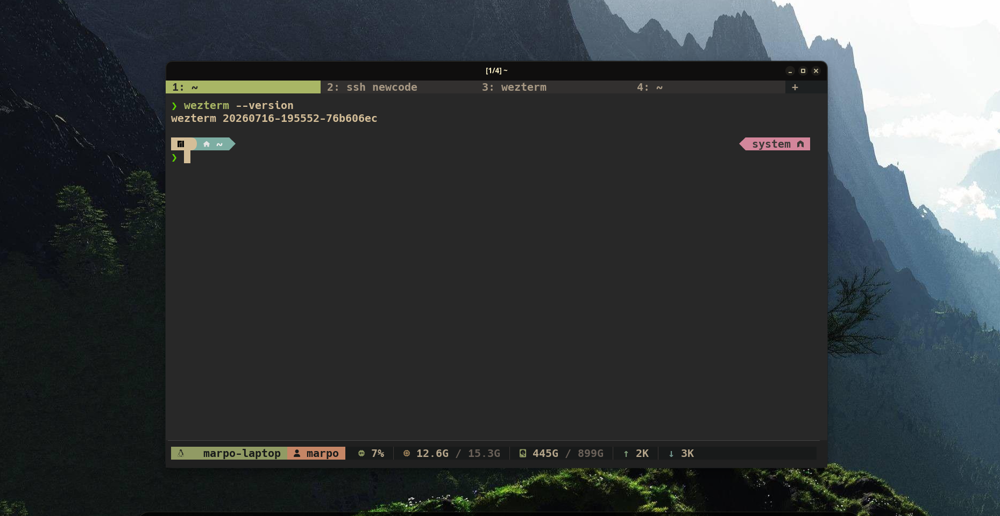

# marpo-wezterm

My [WezTerm](https://wezfurlong.org/wezterm/) configuration.



## Install

```bash
git clone https://github.com/<user>/marpo-wezterm.git
cd marpo-wezterm
./setup.sh
```

## Update

```bash
./setup.sh
```

`setup.sh` pulls the latest changes, installs missing packages (`wezterm`, `ttf-hack-nerd`) and syncs the config to `~/.config/wezterm`, backing up the old config if it differs.

Use `./setup.sh --no-pull` to skip the `git pull`.

## Layout

- `wezterm.lua`: entry point
- `lua/core/`: base settings (options, appearance, fonts, keymaps, mouse)
- `lua/plugins/`: features (SSH picker, colored tabs, session restore)
- `lua/custom/`: personal tweaks (`preferences.lua`)
- `scripts/`: helper shell scripts

Shortcuts: see [SHORTCUTS.md](SHORTCUTS.md).
